<p align="center">
  
</p>

AaaS is a self-hosted platform for offering dedicated, isolated [Hermes Agent](https://hermes-agent.nousresearch.com) instances as personal AI assistants to your customers ("tenants"). Each tenant's agent runs in its own Docker container, so a tenant's data and conversations stay private — never shared with other tenants or with the platform operator.

The platform is run by two admin agents:

- **OpenCode admin** — an interactive assistant for hands-on operational work: onboarding and offboarding tenants, running platform health checks, and general maintenance. Used directly by the operator at their machine.
- **Hermes admin** — the same operational capabilities, reachable over Telegram for when the operator is away. It also acts as the notification bridge from tenants to the operator: when a tenant agent needs to flag something, it messages Hermes admin, which relays it to the operator over Telegram. This bridge is one-way, tenant to operator only.

`install.sh` sets up the platform side: it provisions the host, installs and configures Hermes as the Hermes admin agent, wires up opencode for the OpenCode admin agent, and enables a watchdog to keep the Hermes admin's gateway running. Onboarding and managing tenants happens afterward, through the two admin agents — not through `install.sh` directly.

The installer is idempotent. Something failed halfway through? Fix it and rerun — it picks up where it left off.

## Quick Install

```bash
curl -fsSL https://raw.githubusercontent.com/jasonlaw/aaas/master/install.sh | bash
```

Prefer to read before you run?

```bash
curl -fsSL -o install.sh https://raw.githubusercontent.com/jasonlaw/aaas/master/install.sh
less install.sh
bash install.sh
```

## What It Installs

- `/opt/aaas/platform` — the platform's own config and admin-agent state
- Node.js, npm, and Docker Engine, where supported — Docker is what tenant agents will later run in, once onboarded
- opencode, powering the OpenCode admin agent (and automated watchdog repair)
- Hermes Agent, from the official Nous Research installer — this becomes the Hermes admin agent
- Telegram gateway configuration for the Hermes admin agent, so the operator can reach it, and it can reach the operator, from anywhere
- the Hermes admin's gateway, running as an official system service
- the AaaS watchdog, keeping that gateway alive, running as an autostart systemd service
- timestamped watchdog alert folders under `/opt/aaas/platform/watchdog/alerts/`

## Requirements

- a Linux host with `bash`, `curl`, `git`, `systemd`, and outbound network access
- `sudo` or root access

Docker installs automatically on supported package managers. On anything else, install Docker yourself first and rerun the installer.

## Operating the Platform

Once installed, day-to-day operations — onboarding a tenant, offboarding one, checking platform health, and similar tasks — go through the two admin agents:

- At your machine, talk to the **OpenCode admin** directly.
- Away from your machine, message the **Hermes admin** on Telegram — same operational capabilities, reachable from anywhere.
- Tenant agents notify you by messaging the Hermes admin, which relays the message to you on Telegram. You don't reply to tenants through this channel.

## Installer Prompts

- primary Hermes provider (default `opencode-zen`) and model (default `big-pickle`)
- optional fallback provider (default `openrouter`) and model (default `free`)
- Telegram bot token for the Hermes admin, from BotFather
- Telegram allowed user IDs, comma-separated — the first one becomes the operator's home channel

## Install Location

```bash
AAAS_ROOT=/opt/aaas          # default
```

Override it for testing:

```bash
AAAS_ROOT="$HOME/aaas-test" bash install.sh
```

## Verification

The watchdog only gets enabled after these all check out:

- Hermes is installed and the `gateway` command is available
- Telegram token and allowlist are configured
- the Hermes admin's gateway system service is running
- the AaaS watchdog system service can start

Something fails? The installer stops there — fix it and rerun the same command.

## Watchdog Alerts

When the watchdog spots a problem, it drops a timestamped alert folder:

```text
/opt/aaas/platform/watchdog/alerts/alert-YYYYmmdd-HHMMSS-PID/alert.txt
```

If `opencode` is available, the watchdog hands it the alert path and asks it to repair the issue. Once opencode has picked it up, it can remove the whole alert folder.

## Useful Commands

```bash
# AaaS watchdog status
sudo systemctl status aaas-watchdog.service

# Follow watchdog logs
tail -f /opt/aaas/platform/watchdog/watchdog.log

# Rerun the installer (safe, idempotent)
bash install.sh
```

For Hermes admin gateway status or general platform health, ask either admin agent directly rather than reaching for raw commands.

## Config Files

Three separate `.env` files, each with a single owner — none of them copy values to or from each other:

| File | Owner | Wired into systemd? | Holds |
|---|---|---|---|
| `~/.hermes/.env` | Hermes itself | No — Hermes finds it via `User=aaas` at gateway startup, not via `EnvironmentFile=` | Provider keys, Telegram token/allowlist, `MNEMOSYNE_HOST_LLM_ENABLED`, etc. — anything `hermes setup` or `hermes gateway setup` writes |
| `/opt/aaas/platform/.env` | `install.sh` | No | `AAAS_ROOT`, `HERMES_REAL_BIN` — install.sh's own bookkeeping across reruns |
| `/opt/aaas/platform/watchdog/.env` | the watchdog | Yes — `aaas-watchdog.service`'s `EnvironmentFile=` | `HERMES_GATEWAY_UNIT` |

If Telegram (or any other Hermes setting) isn't taking effect after a gateway restart, check `~/.hermes/.env` directly — that's the only file the gateway process reads.

## Bootstrap Placeholder Resolve Table

Files under `platform/` (skill docs, `.hermes/config.yaml`, etc.) are synced onto the target host with literal `__TOKEN__` placeholders, then resolved in place by `install.sh` (`build_bootstrap_placeholder_table` / `init_platform_placeholders`) once `AAAS_HOME` is known. Add a new token once to either table and it's resolved automatically everywhere it appears — no per-file `sed` needed.

| Placeholder | Resolves to |
|---|---|
| `__ROOT_DIR__` | `$AAAS_ROOT` (default `/opt/aaas`) |
| `__PLATFORM_DIR__` | `${ROOT_DIR}/platform` |
| `__HERMES_HOME__` | `${AAAS_HOME}/.hermes` |
| `__AAAS_USER__` | the service account Hermes and the watchdog run as |
| `__AAAS_GROUP__` | that account's group |
| `__CONFIG_FILE__` | `${PLATFORM_DIR}/.env` (install.sh's own bootstrap file — see table above) |
| `__WATCHDOG_DIR__` | `${PLATFORM_DIR}/watchdog` |
| `__WATCHDOG_ENV_FILE__` | `${WATCHDOG_DIR}/.env` (the watchdog's own env file — see table above) |
| `__ALERT_DIR__` | `${WATCHDOG_DIR}/alerts` |

Files requiring every placeholder to resolve successfully (install fails otherwise) are listed in `PLATFORM_PLACEHOLDER_FILES_REQUIRED`; anything else synced under `platform/` is optional and just skipped if absent.

## `.hermes/config.yaml` Bootstrap Directives

`platform/.hermes/config.yaml` is merged onto the config.yaml Hermes's own setup wizard generates — a real YAML parse/merge, not a text append — then deleted. Per-key merge behavior is controlled by an optional trailing comment directive on that key's own line:

```yaml
provider: mnemosyne     # @force     (default if no directive given)
fallback: openai        # @default
telegram:                # @disable
```

| Directive | Behavior |
|---|---|
| `@force` | Always overwrite this key with the bootstrap value, every run. This is also the default when a key has **no** directive at all. |
| `@default` | Only set this key if it's missing from the real config — never clobbers an existing/user-set value. Idempotent: a no-op after the first run. |
| `@disable` | Always comment this key out of the final `config.yaml`, regardless of what Hermes generated. Top-level keys only. |

All three are idempotent by construction, so no "consumed" bookkeeping or backup-renaming is needed — the bootstrap file can be left in place and rerun safely. A dict-valued key with no explicit directive recurses (sibling keys the bootstrap file doesn't mention are preserved); an explicit `@force` on a dict-valued key replaces that whole subtree atomically instead.


Do not commit runtime secrets, logs, generated watchdog files, or alert folders. This repository holds preset files only — runtime state belongs under `/opt/aaas` on the target host.